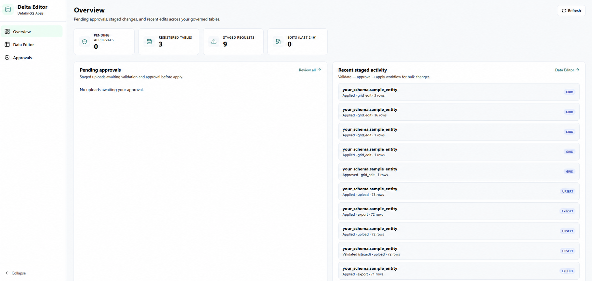
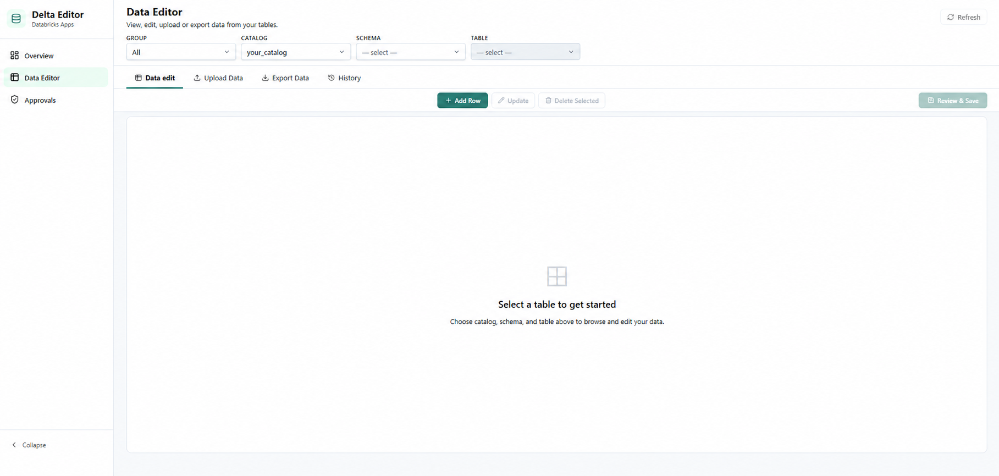
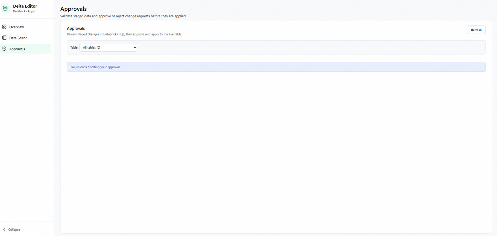

# Delta Table Editor

> Production-grade Delta table editor on **Databricks Apps** —
> FastAPI + React + Unity Catalog per-user security +
> business rule engine + approval workflow + audit trail.

---

## Screenshots

### Overview



### Data editor



### Approval workflow



---

## Why this exists

Data teams spend hours writing SQL patch scripts and processing Excel correction files from
business users. This app replaces that pattern with a governed, self-service UI that runs
**inside** your existing Databricks workspace — no new SaaS, no new infrastructure.

**Business users** edit reference and configuration data directly through a validated UI.
**Engineers** onboard new tables via YAML config — no code changes needed.
**Auditors** see a full column-level change history with real user identity (via Unity Catalog).

---

## Architecture

```
┌─────────────────────────────────────────────────────────────┐
│                    DATABRICKS WORKSPACE                      │
│                                                             │
│  ┌──────────────────┐      ┌─────────────────────────────┐  │
│  │  React Frontend  │─────▶│     FastAPI Backend          │  │
│  │  (Vite build)    │      │     (Uvicorn / Gunicorn)     │  │
│  │                  │      │                              │  │
│  │  • Column editor │      │  • Per-user token auth       │  │
│  │  • Inline filter │      │  • Config-driven validation  │  │
│  │  • Review diff   │      │  • Business rule engine      │  │
│  │  • Bulk upload   │      │  • Optimistic locking        │  │
│  │  • Audit history │      │  • Audit log writes          │  │
│  └──────────────────┘      └──────────────┬──────────────┘  │
│                                           │                  │
│                    ┌──────────────────────┼────────────┐     │
│                    │                      │            │     │
│            ┌───────▼──────┐   ┌──────────▼─────┐      │     │
│            │  SQL         │   │  Config Delta   │      │     │
│            │  Warehouse   │   │  Tables         │      │     │
│            │              │   │                 │      │     │
│            │  Per-user    │   │  table_registry │      │     │
│            │  token conn  │   │  column_config  │      │     │
│            └──────┬───────┘   │  business_rules │      │     │
│                   │           └────────────────-┘      │     │
│                   │                                     │     │
│            ┌──────▼──────────────────────────────┐     │     │
│            │  Unity Catalog                       │     │     │
│            │  • Table-level grants per group      │     │     │
│            │  • Row filters / column masks        │     │     │
│            │  • Enforced at SQL layer             │     │     │
│            └──────┬──────────────────────────────┘     │     │
│                   │                                     │     │
│            ┌──────▼──────┐   ┌───────────────────┐     │     │
│            │  Business   │   │  Audit Log         │     │     │
│            │  Delta      │   │  (column-level,    │     │     │
│            │  Tables     │   │   real user id)    │     │     │
│            └─────────────┘   └───────────────────┘     │     │
│                                                         │     │
└─────────────────────────────────────────────────────────┘     │
                                                               │
        Azure AD / Entra ID (SSO + SCIM + Group Membership)   │
        Injects X-Forwarded-Access-Token per request ──────────┘
```

---

## Key design decisions

### 1. Per-user token — not service principal
Every SQL query runs under the **logged-in user's token** (forwarded by Databricks Apps via
`X-Forwarded-Access-Token`). Unity Catalog row filters and column masks apply automatically.
No shared service account bypasses data governance.

### 2. Config-driven — no code per table
Tables are onboarded via YAML files (`config/tables/*.yaml`) deployed to Delta config tables.
Column types, labels, dropdowns, validation rules, and approval requirements are all in config.
Adding a new table takes ~10 minutes and zero Python changes.

### 3. Staging → validate → apply for bulk operations
Bulk CSV uploads never write directly to the target table. They go through:
`parse → stage to Delta → validate all-or-nothing → apply or queue for approval`
This makes bulk changes safe, reviewable, and reversible.

### 4. Optimistic locking via `version` column
Every UPDATE increments a `version` column in a single statement:
`UPDATE ... SET col = ?, version = version + 1 WHERE pk = ? AND version = ?`
If two users save the same row simultaneously, the second gets a clear conflict error.

### 5. Column-level audit trail
Every save writes one audit row **per changed column** — not per row. Auditors can see
exactly which field changed, who changed it, the old value, and the new value.

---

## Project structure

```
delta-table-editor/
├── backend/
│   ├── main.py                    ← FastAPI app — all endpoints
│   └── shared/
│       ├── db_client.py           ← Databricks SQL connector (per-user token)
│       ├── config_store.py        ← Read table/column config from Delta
│       ├── config_rules.py        ← Business rule engine (6 rule types)
│       ├── export_ops.py          ← Streaming CSV export to UC Volume
│       ├── bulk_update_ops.py     ← Bulk UPDATE by primary key
│       ├── bulk_upload_ops.py     ← CSV → stage → validate → apply
│       ├── staging_ops.py         ← Staging table lifecycle
│       ├── approval_ops.py        ← Approval workflow management
│       ├── change_request.py      ← Change request CRUD
│       └── audit_cols.py          ← Auto-fill audit column helpers
├── frontend/
│   └── src/
│       ├── App.jsx                ← Main app state
│       ├── api/client.js          ← All API calls in one place
│       └── components/
│           ├── DataGrid.jsx       ← Editable grid with inline filters
│           ├── Panels.jsx         ← Review, Upload, History, Paste panels
│           ├── Sidebar.jsx        ← Overview / Editor / Approvals nav
│           ├── TabBar.jsx         ← Data / Upload / History tabs + actions
│           └── TopNav.jsx         ← Catalog → Schema → Table → Columns nav
├── agent-builder/                 ← LLM-powered YAML config generator
│   ├── core/                      ← LiteLLM, Databricks, YAML utils
│   └── agents/table_config/       ← Prompt + generator for table YAML
├── config/
│   ├── defaults.yaml              ← Audit columns applied to every table
│   └── tables/                    ← One YAML file per onboarded table
├── scripts/
│   ├── deploy_config.py           ← Deploy YAML configs to Delta tables
│   ├── setup_config_tables.sql    ← Idempotent table creation
│   └── build_for_deploy.sh        ← npm build + copy to static/
├── setup.sql                      ← One-time workspace setup
├── app.yaml                       ← Databricks Apps config
└── startup.sh                     ← App entry point
```

---

## Feature overview

| Feature | Detail |
|---|---|
| **Multi-table navigation** | Catalog → Schema → Table → Column selector in one top nav |
| **Inline grid editing** | Click-to-edit cells with dropdown, date, boolean, text inputs |
| **Column filters** | Excel-style filter row under every column header |
| **Review before save** | Diff panel shows old → new values before committing |
| **Paste rows** | Paste CSV text directly into the grid |
| **Bulk upload** | CSV/Excel/TSV — modes: update by PK, append, overwrite |
| **Streaming export** | Server-side export to UC Volume → browser download |
| **Approval workflow** | Per-table policy: stage → review → approve/reject → apply |
| **Business rules** | 12 rule types (regex, date_order, lookup, min/max, etc.) |
| **Optimistic locking** | `version` column prevents lost updates |
| **Per-user auth** | `X-Forwarded-Access-Token` → Unity Catalog enforces grants |
| **Column-level audit** | Old value / new value / user / timestamp per column |
| **AI config generator** | LLM agent auto-generates table YAML from `DESCRIBE TABLE` |
| **Idle auto-stop** | App stops after N minutes idle — reduces compute cost |
| **Zero CDN** | Vite-built static assets only — no runtime CDN dependency |

---

## Local development

### Prerequisites
- Python 3.11+
- Node.js 18+
- Access to a Databricks workspace with a SQL Warehouse

### 1. Backend

```bash
cd delta-table-editor

# Copy and fill in environment variables
cp .env.example .env
# Edit .env:
#   DATABRICKS_HOST=https://your-workspace.azuredatabricks.net
#   DATABRICKS_HTTP_PATH=/sql/1.0/warehouses/your-warehouse-id
#   DATABRICKS_TOKEN=dapi...
#   TARGET_CATALOG=your_catalog

pip install -r requirements.txt

# Run setup SQL in Databricks once
# (open setup.sql in Databricks SQL editor and run it)

# Start FastAPI (Swagger UI at http://localhost:8000/docs)
uvicorn backend.main:app --host 0.0.0.0 --port 8000 --reload
```

### 2. Frontend

```bash
cd frontend
npm install

# Vite proxies /api → localhost:8000 automatically
npm run dev
# Open http://localhost:5173
```

### 3. Build for production

```bash
cd frontend && npm run build
# Output goes to ../static/ — FastAPI serves it automatically

# Or use the helper script:
bash scripts/build_for_deploy.sh
```

---

## Databricks Apps deployment

### One-time setup

```bash
# 1. Run setup SQL in your workspace
#    Open setup.sql in Databricks SQL editor → Run all

# 2. Deploy table YAML configs
python scripts/deploy_config.py --all

# 3. Build the frontend
bash scripts/build_for_deploy.sh
```

### Deploy the app

1. Upload the `delta-table-editor/` folder to your Databricks workspace
   (`.databricksignore` excludes `node_modules`, `.env`, `__pycache__`)
2. Create a Databricks App pointing to the folder
3. Bind a SQL Warehouse: **Apps → Settings → Resources → key = `sql-warehouse`**
4. Set `TARGET_CATALOG` in `app.yaml` if different from `your_catalog`
5. Open the App URL — the startup screen appears while the warehouse warms up

---

## Onboarding a new table (3 steps)

**Step 1** — Create a YAML file:
```bash
cp config/tables/your_schema.sample_entity.yaml \
   config/tables/your_schema.your_table.yaml
# Edit: schema, table name, columns, rules
```

**Step 2** — Deploy it:
```bash
python scripts/deploy_config.py --file config/tables/your_schema.your_table.yaml
```

**Step 3** — Grant UC permissions:
```sql
GRANT SELECT, MODIFY ON TABLE your_catalog.your_schema.your_table
  TO `your-group@your-domain.com`;
```

The table appears in the app immediately — no restart needed.

---

## AI config generator (agent-builder)

The `agent-builder/` module uses an LLM (via LiteLLM) to auto-generate table YAML
from a `DESCRIBE TABLE` output. Useful when onboarding tables with many columns.

```bash
cd agent-builder
pip install -r requirements.txt
cp .env.example .env   # set LITELLM_BASE_URL, LITELLM_API_KEY, LITELLM_MODEL

# Auto-fetch DESCRIBE from Databricks and generate YAML:
python agents/table_config/generate.py \
  --schema your_schema \
  --table your_table \
  --primary-keys record_id \
  --fetch-describe \
  --validate
```

---

## Tech stack

| Layer | Technology |
|---|---|
| Frontend | React 18, Vite, CSS Modules, Lucide icons |
| Backend | FastAPI, Uvicorn/Gunicorn, Pydantic v2 |
| Database | Databricks SQL Connector, Delta Lake, Unity Catalog |
| Auth | Databricks Apps SSO (Azure AD / Entra ID) |
| Config | YAML files → Delta tables via deploy script |
| AI (optional) | LiteLLM gateway → any LLM provider |
| Deployment | Databricks Apps (no external infrastructure) |

---

## Contributing

Pull requests welcome. For significant changes, open an issue first to discuss approach.

---

## License

MIT
